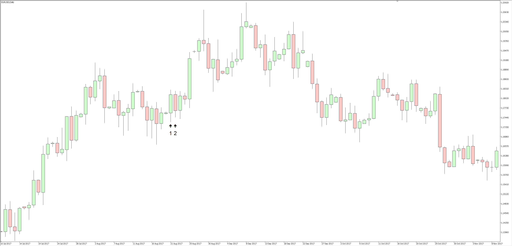

# MQL 5 Resources

Interesting MQL 5 techniques, scripts, EA's and indicators.

Supporting writeups and articles can be found on my [website](https://scottedwards.tech/).

Note: your use of any of the code in this repository is entirely at your own risk. I will accept no responsibility for any decisions you make based off the code in this repository.

## Price Action Patterns

### Inside Bar

An Inside Bar is a price action pattern where the range of a candle is completely engulfed by the range of the previous candle.

